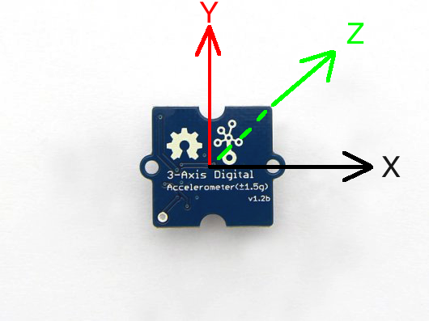
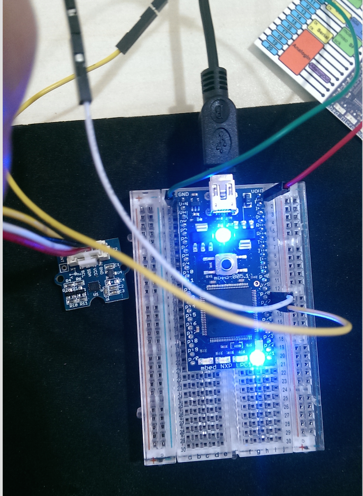
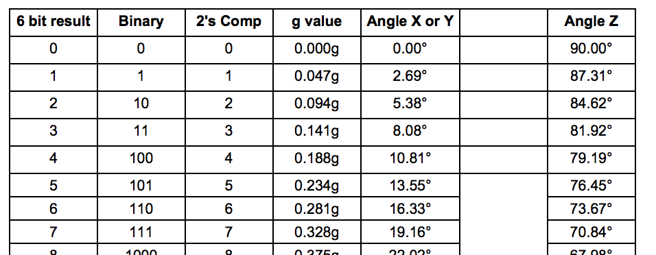

# Grove - 3Axis Digital Accelerometer

三軸加速度感測器的可以在預先不知道物體運動方向的情況下，應用各個維度的加速度感測器來檢測加速度資訊。三維加速度感測器具有體積小和輕量的特點，可以測量空間加速度，並且能夠全面準確反映物體的運動情形。本文使用的[三軸加速感測器為此](http://www.seeedstudio.com/depot/Grove-3Axis-Digital-Accelerometer15g-p-765.html)。



圖1 三軸方向示意圖


## 腳位接法

| HC05 pin | Mbed pin   |
| -------- | ---------- |
| 1 - SCL  | P27 - SCL  |
| 2 - SDA  | P28 - SDA  |
| 3 - Vcc  | Vout - 3.3V|
| 4 - GND  | GND        |



圖2 腳位接法範例圖

備註：Mbed腳位只要是 SCL及 SDA即可，以 LPC1768為例：P9、P10也可使用。	


## 數據解析

感測器本身會會回傳 0~63的結果，我們可以透過此結果依表轉換成 G值(1g=m/s^2)或者角度(不建議使用)，詳細對照表可參照[此文件](http://www.freescale.com.cn/files/sensors/doc/data_sheet/MMA7660FC.pdf?fpsp=1) P.26~P.27。



圖3 數據解析對照表


## 程式碼

開始撰寫 ARM mbed 程式碼。首先，必須引入 mbed.h及 MMA7660FC.h標頭檔，接著將連接腳位。並且我們利用 LED燈來顯示感測器的變化。

程式碼如下：

```
#include "mbed.h"
#include "MMA7660FC.h"
 
DigitalOut myled1(LED1);
DigitalOut myled2(LED2);
DigitalOut myled3(LED3);
DigitalOut myled4(LED4);
 
#define ADDR_MMA7660 0x98                   // I2C SLAVE ADDR MMA7660FC
 
MMA7660FC Acc(p28, p27, ADDR_MMA7660);      //sda、cl、Addr，更換接角時請務必更改此處
Serial pc(USBTX, USBRX);

// G值對照表
float G_VALUE[64] = {0, 0.047, 0.094, 0.141, 0.188, 0.234, 0.281, 0.328, 0.375, 0.422, 0.469, 0.516, 0.563, 0.609, 0.656, 0.703, 0.750, 0.797, 0.844, 0.891, 0.938, 0.984, 1.031, 1.078, 1.125, 1.172, 1.219, 1.266, 1.313, 1.359, 1.406, 1.453, -1.500, -1.453, -1.406, -1.359, -1.313, -1.266, -1.219, -1.172, -1.125, -1.078, -1.031, -0.984, -0.938, -0.891, -0.844, -0.797, -0.750, -0.703, -0.656, -0.609, -0.563, -0.516, -0.469, -0.422, -0.375, -0.328, -0.281, -0.234, -0.188, -0.141, -0.094, -0.047};
 
 
int main() 
{
 
    Acc.init();                                                     // Initialization
    pc.printf("Value reg 0x06: %#x\n", Acc.read_reg(0x06));         // Test the correct value of the register 0x06
    pc.printf("Value reg 0x08: %#x\n", Acc.read_reg(0x08));         // Test the correct value of the register 0x08
    pc.printf("Value reg 0x07: %#x\n\r", Acc.read_reg(0x07));       // Test the correct value of the register 0x07
           
    while(1)
    {   
        myled4=1;
        float x=0, y=0, z=0;
        float ax=0, ay=0, az=0;
        
        Acc.read_Tilt(&x, &y, &z);                                  // Read the acceleration                    
        pc.printf("Tilt x: %2.2f degree \n", x);                    // Print the tilt orientation of the X axis
        pc.printf("Tilt y: %2.2f degree \n", y);                    // Print the tilt orientation of the Y axis
        pc.printf("Tilt z: %2.2f degree \n", z);                    // Print the tilt orientation of the Z axis
 
        wait_ms(100);
 
        pc.printf("x: %1.3f g \n", G_VALUE[Acc.read_x()]);          // Print the X axis acceleration
        pc.printf("y: %1.3f g \n", G_VALUE[Acc.read_y()]);          // Print the Y axis acceleration
        pc.printf("z: %1.3f g \n", G_VALUE[Acc.read_z()]);          // Print the Z axis acceleration
        pc.printf("\n");
        
        //換算成 G值
        ax = G_VALUE[Acc.read_x()];
        ay = G_VALUE[Acc.read_y()];
        az = G_VALUE[Acc.read_z()];
        
        //用 LED簡單展示數值變化
        if(ax<0){
            myled1=1;
        }else{
            myled1=0; 
        }
        if(ay<0){
            myled2=1;
        }else{
            myled2=0; 
        }
        if(az<0){
            myled3=1;
        }else{
            myled3=0; 
        }
        
        wait(1);
          
    }
}
```


## 參考資源
* https://developer.mbed.org/components/Grove-3Axis-Digital-Accelerometer/
* http://developer.mbed.org/users/edodm85/notebook/grove---3-axis-accelerometer/
* http://www.seeedstudio.com/wiki/Grove_-_3-Axis_Digital_Accelerometer%28%C2%B11.5g%29
